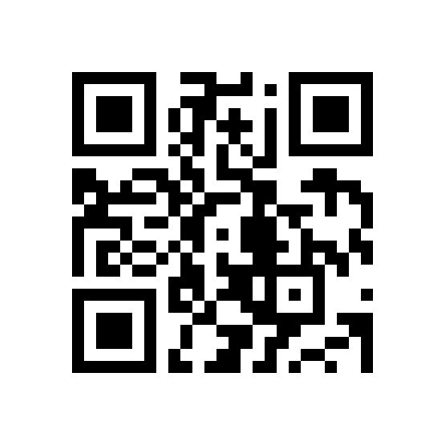

# Mon PORTOFOLIO
Crée dans le but de me faire un portofolio.
Pour le moment il n'y a pas d'informations pertinentes dedans, juste des placeholders pour là où je vais mettre mes projets (faites pas attention au design très **"ANIME"** ce n'est en **aucun cas** le design final).

# Ce qu'il reste à faire
Remplir le site avec mes **données**, le transformer en **PWA**. ~Ajouter une **Favicon**~.

# Technologies utilisées
Ce site est fait avec du Jquery, CSS, HTML, et des tas de plugins ! Voici une liste des plugins utilisés:
- [Typed.js](https://github.com/mattboldt/typed.js/)
- [superslides.js](https://github.com/nicinabox/superslides)
- [easyPieChart.js](https://github.com/rendro/easy-pie-chart)
- [owlCarousel.js](https://owlcarousel2.github.io/OwlCarousel2/)
- [countUp.js](https://github.com/inorganik/CountUp.js)
- [fancybox.js](http://fancyapps.com/fancybox/3/)
- [isotop.js](https://isotope.metafizzy.co/)

# TinyURL link
http://tiny.cc/cnzb5y

# QR code to my site

## &copy; [Jean-Adrian OIKONOMOU](https://github.com/Jean-OIKONOMOU)
